Loading packages: 


```r
library(dada2)
library(ranacapa)
library(devtools)
library(tictoc)
library(ape)
library(phyloseq)
library(picante)
library(phangorn)
library(devtools)
library(Vennerable)
library(vegan)
library(ShortRead)
library(DECIPHER)
library(msa)
library(qiimer)
library(ggplot2)
library(BiodiversityR)
library(grid)
```


# QIIME I

Check we have all files needed:

-  Metadata
-  Reads
-  reference dataset (Greengenes)


### Quality Treatment 

Filter: 

Maximum unacceptable Phred quality score, -q=19 will keep Q20 and better.


```bash

$QIIME1
SAMPLE_IDS="WT.day3.11,WT.day3.13,WT.day3.14,WT.day3.15,WT.day3.9,WT.unt.1,WT.unt.2,WT.unt.3,WT.unt.4,WT.unt.7"

# echo $SAMPLE_IDS

split_libraries_fastq.py -i ./16SDATA/16S_WT_day3_11_SRR2628505_1.fastq.gz,./16SDATA/16S_WT_day3_13_SRR2628506_1.fastq.gz,./16SDATA/16S_WT_day3_14_SRR2627471_1.fastq.gz,./16SDATA/16S_WT_day3_15_SRR2628507_1.fastq.gz,./16SDATA/16S_WT_day3_9_SRR2628504_1.fastq.gz,./16SDATA/16S_WT_unt_1_SRR2627457_1.fastq.gz,./16SDATA/16S_WT_unt_2_SRR2627461_1.fastq.gz,./16SDATA/16S_WT_unt_3_SRR2627463_1.fastq.gz,./16SDATA/16S_WT_unt_4_SRR2627464_1.fastq.gz,./16SDATA/16S_WT_unt_7_SRR2627465_1.fastq.gz --sample_ids $SAMPLE_IDS -o $PATH_Q1/filtered_q20 -q 19 --barcode_type 'not-barcoded' --phred_offset 33

```


    output files in 'filtered_q20' folder

      "histograms.txt"
  
      "seqs.fna"
  
      "split_library_log.txt"

### Picking Operational Taxonomic Units (OTU)

Open-reference OTU picking: applies first closed-reference method, and subsequent de novo clustering on those sequences not matching the reference within the  similarity threshold

Sequences will be clustered into OTUs against reference sequence collection: 97_otus_fasta, greengenes database: 

the pick_open_reference_OTU.py command will: 

-  pick OTUs: based on SIMILARITY, will pick a representative sequence from each OTU.
-  taxonomy assignment: assign the OTU to a TAXONOMIC identity using reference databases
-  sequence alignment, will build a phylogenetic tree

We will use then: 
  
  the filtered sequences: seqs.fna 
  the OTUs reference: 97_otus.fasta (by default if no parameter specified)


```bash


$QIIME1
pick_open_reference_otus.py -o $PATH_Q1/otus/ -i $PATH_Q1/filtered_q20/seqs.fna

```

Output:


```
## final_otu_map_mc2.txt
## final_otu_map.txt
## index.html
## log_20180914173807.txt
## otu_table_mc2.biom
## otu_table_mc2_w_tax.biom
## otu_table_mc2_w_tax_no_pynast_failures.biom
## pynast_aligned_seqs
## rep_set.fna
## rep_set.tre
## step1_otus
## step4_otus
## uclust_assigned_taxonomy
```

Mainly interested in otu_table_mc2_w_tax_no_pynast_failures.biom
  - with taxonomic assignments for each OTU as observation metadata
  - without sequences failing the alignment to the OTU representative sequences.
  - no OTUs with a total count of 1
  - no OTUs whose representative sequence couldn't be aligned with PyNAST

To obtain summary statistics of the OTU table:


```bash

$QIIME1
biom summarize-table -i $PATH_Q1/otus/otu_table_mc2_w_tax_no_pynast_failures.biom

```

This summary will be used to determine the depth of sequencing to be used in diversity analyses.

Any samples that don't have at least that many sequences (sample depth) will not be included in the analysis (number of sequences Vs number of samples discarded - trade-off )

In the Counts/sample detail:

- Min: 7786 will be in this example the sample depth


### Diversity Analysis

- alpha diversity:  ecological complexity of a single sample
- beta diversity:   differences between samples


```bash

$QIIME1
core_diversity_analyses.py -o $PATH_Q1/cdout/ --recover_from_failure -c "AntibioticUsage" -i $PATH_Q1/otus/otu_table_mc2_w_tax_no_pynast_failures.biom -m $PATH_16S/metadata.tab -t $PATH_Q1/otus/rep_set.tre -e 7786

```

 
 
[Click here to see the results](./QIIMEI/cdout/index.html)


The Taxonomy Summary Results show bar_charts with the different taxonomic levels observed in each sample, or by category (AntibioticUsage, in this case), comparing between groups.


```bash


#level 7
#doing the summary first, with Q1 tools, then plotting. *Note, plot_taxa_summary.py doenst work with qiime installation with matplotlib 2.2.2, only works with conda qiime installation 

$QIIME1

summarize_taxa.py \
-i $PATH_Q1/cdout/table_even7786.biom -L 7 \
-o $PATH_Q1/LEV7/otus_level7_raref/relative_abundance/

plot_taxa_summary.py \
-i $PATH_Q1/LEV7/otus_level7_raref/relative_abundance/table_even7786_L7.txt \
-o $PATH_Q1/LEV7/level7_plots

```


[Click here for Level 7 Bar Chart](./QIIMEI/LEV7/level7_plots/bar_charts.html)

#QIIME II


Data produced by QIIME2 exist as Artifacts, containing data and metadata. Typically has the .qza extension. Visualizations (.qzv) are terminal outputs of an analysis.

Fastq manifest formats:

Manifest file maps sample identifiers to fastq.gz or fastq absolute filepaths that contain sequence and quality data for the sample, and indicates the direction of the reads


Edit your manifest file and run:


### Importing data:


```bash

$QIIME2

qiime tools import \
 --type 'SampleData[SequencesWithQuality]' \
 --input-path $PATH_Q2/importing_data/se-33-manifest-mine \
 --output-path $PATH_Q2/single-end-demux.qza \
 --input-format SingleEndFastqManifestPhred33

```

### Summarizing sequence counts:


```bash

$QIIME2

qiime demux summarize \
--i-data $PATH_Q2/single-end-demux.qza \
--output-dir $PATH_Q2/summary

```


we can explore the Sequence Counts summary plot, and the 
Interactive Quality Plot: 

[Click here to take a look](./QIIME2/summary/visualizationfolder/data/index.html)


### Sequence Quality Control and Feature Table Construction

### Dada2
The result will be a 

- FeatureTable[Frequency] QIIME 2 artifact: contains counts (frequencies) of each unique sequence in each sample in the dataset                          
- FeatureData[Sequence] QIIME 2 artifact:maps feature identifiers in the 
- FeatureTable to the sequences they represent.

The "OTUs" resulting from DADA2 are created by grouping unique sequences, equivalent of 100% OTUs from QIIME1, and are generally referred to as sequence variants. DADA2 is a pipeline for detecting and correcting Illumina amplicon sequence data. Quality control process will filter phiX reads and chimeric sequences.


Creation of representative sequences and table:
--p-trunc-q INTEGER
Reads are truncated at the first instance of a quality score less than or equal to this value. If the resulting read is then shorter than 'trunc_len', it is discarded.

q --> 19 to try to have similar results than with qiimeI


```bash

$QIIME2

qiime dada2 denoise-single \
--i-demultiplexed-seqs $PATH_Q2/single-end-demux.qza \
--p-trunc-len 0 \
--p-trunc-q 19 \
--output-dir $PATH_Q2/DADA2/

```

Output: 

- table.qza
- representative_sequences.qza

### FeatureTable and FeatureData summaries: 

Creation of visual summaries to explore the resulting data: 

 - feature-table summarize: 
 how many sequences are associated with each sample and with each feature, histograms of those distributions, and some related summary statistics.
 
 
 


```bash

$QIIME2

qiime feature-table summarize \
--i-table $PATH_Q2/DADA2/table.qza \
--o-visualization $PATH_Q2/DADA2/table-dada2.qzv \
--m-sample-metadata-file ./16SDATA/metadata.tab 

```

[Click here to take a look](./QIIME2/DADA2/table-dada_html/data/index.html)


- feature-table tabulate-seqs: 
 maps of feature IDs to sequences, and provide links to easily BLAST each sequence against the NCBI nt database.


```bash

$QIIME2
qiime feature-table tabulate-seqs \
--i-data $PATH_Q2/DADA2/representative_sequences.qza \
--o-visualization $PATH_Q2/DADA2/rep-seqs-dada2.qzv

```

[Click here to take a look](./QIIME2/DADA2/rep-seqs-dada2_html/data/index.html)


### Phylogenetic diversity analyses

### Generating a Tree

QIIME supports several phylogenetic diversity metrics as: 
         Faith's Phylogenetic Diversity
         Weighted & Unweighted Unifrac

These metrics require: 
      -counts of features per sample (as the FeatureTable[Frequency])
      -a rooted phylogenetic tree relating the features to one another.
  
 Steps to generate this Phylogeny[Rooted] QIIME2 artifact: 
 
 -- Multiple sequence alignment of the sequences in
 FeatureData[Sequence] --> FeatureData[AlignedSequence]
    


```bash

$QIIME2

qiime alignment mafft \
--i-sequences $PATH_Q2/DADA2/representative_sequences.qza \
--o-alignment $PATH_Q2/DADA2/aligned-rep-seqs-dada2.qza

```

Output: 

  - aligned-rep-seqs-dada2.qza
  


```bash

$QIIME2

qiime tools export \
--input-path $PATH_Q2/DADA2/aligned-rep-seqs-dada2.qza \
--output-path ./exported_data

```


Next, we filter the alignment to remove highly variable positions, that are generally considered to add noise to a resulting phylogenetic tree.


```bash

$QIIME2

qiime alignment mask \
--i-alignment $PATH_Q2/DADA2/aligned-rep-seqs-dada2.qza \
--o-masked-alignment $PATH_Q2/DADA2/masked-aligned-rep-seqs-dada2.qza

```

FastTree generates a phylogenetic tree from the masked alignment:


```bash

$QIIME2
qiime phylogeny fasttree \
--i-alignment $PATH_Q2/DADA2/masked-aligned-rep-seqs-dada2.qza \
--o-tree $PATH_Q2/DADA2/unrooted-tree.qza

```

Output: unrooted-tree.qza

Final Step:
Midpoint rooting places the root:


```bash

$QIIME2
qiime phylogeny midpoint-root \
--i-tree $PATH_Q2/DADA2/unrooted-tree.qza \
--o-rooted-tree $PATH_Q2/DADA2/rooted-tree.qza

```

Output: rooted-tree.qza

###Alpha and beta diversity analysis

q2-diversity plugin supports:
   alpha and beta diversity metrics
   applying related statistical tests
   generation of interactive visualizations
   
  
1. core-metrics plylogenetic:
- rarefies a FeatureTable[Frequency] to a specified depth
- computes alpha & beta diversity metrics
- generates PCoA plots using Emperor for beta-diversity metrics

Metrics computed by default:

* Alpha diversity

      > Shannon’s diversity index (a quantitative measure of community richness)
      
      > Observed OTUs (a qualitative measure of community richness)
      
      > Faith’s Phylogenetic Diversity (a qualitiative measure of community richness that incorporates phylogenetic relationships between the features)
      
      > Evenness (or Pielou’s Evenness; a measure of community evenness)

* Beta diversity
      
      > Jaccard distance (a qualitative measure of community dissimilarity)
      
      > Bray-Curtis distance (a quantitative measure of community dissimilarity)
      
      > unweighted UniFrac distance (a qualitative measure of community dissimilarity that incorporates phylogenetic relationships between the features)
    
      > weighted UniFrac distance (a quantitative measure of community dissimilarity that incorporates phylogenetic relationships between the features)


#### --p-sampling-depth: 
  
  even sampling (i.e. rarefaction) depth. 

Most diversity metrics are sensitive to different sampling depths across different samples.
The following script will randomly subsample the counts for each sample to the --p-sampling-depth value.
Example: 
for sample depth  5474 (value of minimal sequence count in samples of this dataset --> see Interactive Sample Detail of FeatureTable and FeatureData summaries)

The command will subsample the counts in each sample withour replacement so that each sample in the resulting table has a total sequence count of 5474.
If the total count for any sample(s) were smaller than that value, those samples would be dropped from the diversity analysis. Its recommended to choose a value as high as possible (retaining more sequences per sample) while excluding as few samples as possible. 


```bash

$QIIME2

qiime diversity core-metrics-phylogenetic \
 --i-phylogeny $PATH_Q2/DADA2/rooted-tree.qza \
 --i-table $PATH_Q2/DADA2/table.qza \
 --p-sampling-depth 5474 \
 --m-metadata-file ./16SDATA/metadata.tab \
 --output-dir $PATH_Q2/core-metrics-results

```

Click to take a look at: 

[Unweighted Unifrac](./QIIME2/core-metrics-results/unweighted_unifrac_emperor_html/data/index.html)

[Weighted Unifrac](./QIIME2/core-metrics-results/weighted_unifrac_emperor_html/data/index.html)

[Bray-Curtis](./QIIME2/core-metrics-results/bray_curtis_emperor_html/data/index.html)

[Jaccard](./QIIME2/core-metrics-results/jaccard_emperor_html/data/index.html)


#### Exploration of the microbial composition in the context of the Antibiotic Usage:

* Test for associations between categories and alpha diversity data: Faith Phylogenetic Diversity (a measure of community richness) and evenness metrics:

    -  Faith Phylogenetic Diversity:


```bash

$QIIME2

qiime diversity alpha-group-significance \
 --i-alpha-diversity $PATH_Q2/core-metrics-results/faith_pd_vector.qza \
 --m-metadata-file ./16SDATA/metadata.tab \
 --o-visualization $PATH_Q2/core-metrics-results/faith-pd-group-significance.qzv

```


  - Evenness:
  

```bash

$QIIME2

qiime diversity alpha-group-significance \
  --i-alpha-diversity $PATH_Q2/core-metrics-results/evenness_vector.qza \
  --m-metadata-file ./16SDATA/metadata.tab \
  --o-visualization $PATH_Q2/core-metrics-results/evenness-group-significance.qzv

```


Click to take a look at:

[FaithPD_Significance](./QIIME2/core-metrics-results/faithPD_html/data/index.html)

[Evenness_Significance](./QIIME2/core-metrics-results/evenness_html/data/index.html)


#### Analyzing sample composition

PERMANOVA analysis in context of categorical metadata uses the 
beta-group-significance command.

It tests whether the distances between samples within a group, such as samples with treatment, are more similar to each other than they are to samples from the without-treatment group.

Here, its applied to the unweighted UniFrac distances using one sample metadata column:


```bash

$QIIME2

qiime diversity beta-group-significance \
--i-distance-matrix $PATH_Q2/core-metrics-results/unweighted_unifrac_distance_matrix.qza \
--m-metadata-file ./16SDATA/metadata.tab \
--m-metadata-column AntibioticUsage \
--o-visualization $PATH_Q2/core-metrics-results/unweighted_unifrac_AntibioticUsage-significance.qzv

```


Click here to see: 

[Unweighted_UF_Antib](./QIIME2/core-metrics-results/unweighted_Antib_html/data/index.html)


#### Checking the reliability of depth: Alpha rarefaction plotting

Exploring alpha diversity as a function of sampling depth: 
qiime diversity alpha-rarefaction visualizer:

This tool computes one or more alpha diversity metrics at multiple sampling depths, in steps between 1 (optionally controlled with --p-min-depth) and the value provided as --p-max-depth.

At each sampling depth step, 10 rarefied tables will be generated, and the diversity metrics will be computed for all samples in the tables. The number of iterations (rarefied tables computed at each sampling depth) can be controlled with --p-iterations. 

Average diversity values will be plotted for each sample at each even sampling depth, and samples can be grouped based on metadata in the resulting visualization if sample metadata is provided with the --m-metadata-file parameter.


```bash

$QIIME2

qiime diversity alpha-rarefaction \
--i-table $PATH_Q2/DADA2/table.qza \
--i-phylogeny $PATH_Q2/DADA2/rooted-tree.qza \
--p-max-depth 6000 \
--m-metadata-file ./16SDATA/metadata.tab \
--o-visualization $PATH_Q2/alpha-rarefaction.qzv

```


[Rarefaction-plots](./QIIME2/alpha_raref_html/data/index.html)

[Click here for more info about these plots](./QIIME2/rarefaction_plots_info)


#### Taxonomic Analysis

Exploring the taxonomic composition of the samples:

1- assign taxonomy to the sequences in our FeatureData[Sequence] artifact. 
  
  
Greengenes 13_8 99% OTUs full-length sequences
  
  Applying this classifier to our sequences, we generate a visualization of the resulting mapping from sequence to taxonomy.
  
  check you have:  gg-13-8-99--nb-classifier.qza in the correct Path
  
  https://data.qiime2.org/2018.8/common/gg-13-8-99-nb-classifier.qza


```bash

$QIIME2

qiime feature-classifier classify-sklearn \
  --i-classifier $PATH_Q2/gg-13-8-99-nb-classifier.qza \
  --i-reads $PATH_Q2/DADA2/representative_sequences.qza \
  --o-classification $PATH_Q2/DADA2/taxonomy_full.qza

```


Output: 

taxonomy_full.qza


Let's produce a visualization object: 


```bash

$QIIME2

qiime metadata tabulate \
--m-input-file $PATH_Q2/DADA2/taxonomy_full.qza \
--o-visualization $PATH_Q2/DADA2/taxonomy_full.qzv

```

[Click here to take a look at the taxonomy table](./QIIME2/DADA2/taxonomy_html/data/index.html)


2. Explore the taxonomic composition of the samples through interactive bar plots.

Generation of the taxa-bar-plots:


Taxonomic Levels: 

- Level 1 = Kingdom 

- Level 2 = Phylum 

- Level 3 = Class 

- Level 4 = Order 

- Level 5 = Family 

- Level 6 = Genus 

- Level 7 = Species 


2. Explore the taxonomic composition of the samples through interactive bar plots.

Generation of the taxa-bar-plots:


```bash

$QIIME2

qiime taxa barplot \
  --i-table $PATH_Q2/DADA2/table.qza \
  --i-taxonomy $PATH_Q2/DADA2/taxonomy_full.qza \
  --m-metadata-file ./16SDATA/metadata.tab \
  --o-visualization $PATH_Q2/DADA2/+taxa-bar-plots_full.qzv

```

[Click here to explore the barplots](./QIIME2/DADA2/taxa_barplots_html/data/index.html)


#DADA2


##Filter and Trim

Read in the names of the fastq files
String manipulation to get lists of the fw and rv fastq files in matched order 

Fw and Rv fastq filenames have format: 

SAMPLENAME_1.fastq because in this case we only have FW.


```r
fnFWs <- sort(list.files(path.16S, pattern="_1.fastq", full.names = TRUE))

fnFWs
```

```
##  [1] "./16SDATA/16S_WT_day3_11_SRR2628505_1.fastq.gz"
##  [2] "./16SDATA/16S_WT_day3_13_SRR2628506_1.fastq.gz"
##  [3] "./16SDATA/16S_WT_day3_14_SRR2627471_1.fastq.gz"
##  [4] "./16SDATA/16S_WT_day3_15_SRR2628507_1.fastq.gz"
##  [5] "./16SDATA/16S_WT_day3_9_SRR2628504_1.fastq.gz" 
##  [6] "./16SDATA/16S_WT_unt_1_SRR2627457_1.fastq.gz"  
##  [7] "./16SDATA/16S_WT_unt_2_SRR2627461_1.fastq.gz"  
##  [8] "./16SDATA/16S_WT_unt_3_SRR2627463_1.fastq.gz"  
##  [9] "./16SDATA/16S_WT_unt_4_SRR2627464_1.fastq.gz"  
## [10] "./16SDATA/16S_WT_unt_7_SRR2627465_1.fastq.gz"
```


Extract sample names 

filenames have format: 16S_WT_XXX_XX_XXXXX_1.fastq


```r
sample.ids <- sapply(strsplit(basename(fnFWs), "_SRR"), `[`, 1)
sample.ids
```

```
##  [1] "16S_WT_day3_11" "16S_WT_day3_13" "16S_WT_day3_14" "16S_WT_day3_15"
##  [5] "16S_WT_day3_9"  "16S_WT_unt_1"   "16S_WT_unt_2"   "16S_WT_unt_3"  
##  [9] "16S_WT_unt_4"   "16S_WT_unt_7"
```

##Examine quality profiles of  reads:

    #visualizing the quality profiles of the  reads: 

Quality Profile Plots of samples 1-3


```r
plotQualityProfile(fnFWs[1:3])
```

```
## Scale for 'y' is already present. Adding another scale for 'y', which
## will replace the existing scale.
```

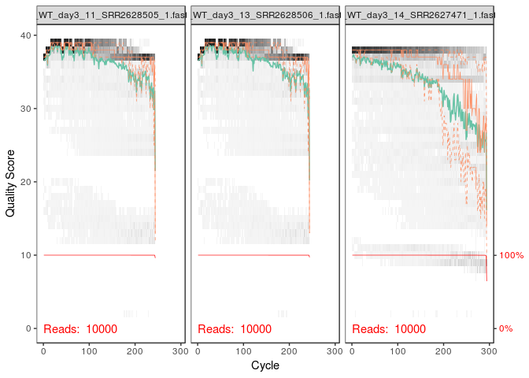<!-- -->


* Perform filtering and trimming: 
    
Assign the filenames for the filtered fastq.gz files:


```r
filt_path <- file.path(path.dada2, paste(path.dada2,"filtered",sep = ""))  #place filtered files in filtered/ subdirectory
filt_FWs <- file.path(filt_path, paste0(sample.ids, "_F_filt.fastq.gz"))

filt_path
```

```
## [1] "./DADA2/./DADA2filtered"
```

```r
filt_FWs
```

```
##  [1] "./DADA2/./DADA2filtered/16S_WT_day3_11_F_filt.fastq.gz"
##  [2] "./DADA2/./DADA2filtered/16S_WT_day3_13_F_filt.fastq.gz"
##  [3] "./DADA2/./DADA2filtered/16S_WT_day3_14_F_filt.fastq.gz"
##  [4] "./DADA2/./DADA2filtered/16S_WT_day3_15_F_filt.fastq.gz"
##  [5] "./DADA2/./DADA2filtered/16S_WT_day3_9_F_filt.fastq.gz" 
##  [6] "./DADA2/./DADA2filtered/16S_WT_unt_1_F_filt.fastq.gz"  
##  [7] "./DADA2/./DADA2filtered/16S_WT_unt_2_F_filt.fastq.gz"  
##  [8] "./DADA2/./DADA2filtered/16S_WT_unt_3_F_filt.fastq.gz"  
##  [9] "./DADA2/./DADA2filtered/16S_WT_unt_4_F_filt.fastq.gz"  
## [10] "./DADA2/./DADA2filtered/16S_WT_unt_7_F_filt.fastq.gz"
```
    


```r
out <- filterAndTrim(fnFWs, filt_FWs, truncLen =200, truncQ=2, maxN=0, maxEE=2, rm.phix=TRUE, compress=TRUE, multithread = TRUE)

out
```

```
##                                      reads.in reads.out
## 16S_WT_day3_11_SRR2628505_1.fastq.gz    10000      9627
## 16S_WT_day3_13_SRR2628506_1.fastq.gz    10000      9640
## 16S_WT_day3_14_SRR2627471_1.fastq.gz    10000      8963
## 16S_WT_day3_15_SRR2628507_1.fastq.gz    10000      9491
## 16S_WT_day3_9_SRR2628504_1.fastq.gz     10000      9608
## 16S_WT_unt_1_SRR2627457_1.fastq.gz      10000      9503
## 16S_WT_unt_2_SRR2627461_1.fastq.gz      10000      9446
## 16S_WT_unt_3_SRR2627463_1.fastq.gz      10000      9544
## 16S_WT_unt_4_SRR2627464_1.fastq.gz      10000      9515
## 16S_WT_unt_7_SRR2627465_1.fastq.gz      10000      9494
```


- Learn the Error Rates

The DADA2 algorithm depends on a parametric error model (err) and every amplicon dataset has a different set of error rates. The learnErrors method learns the error mode from the data, by alternating estimation of the error rates and inference of sample composition until they converge on a jointly consistent solution. As in many optimization problems, the algorithm must begin with an initial guess, for which the maximum possible error rates in this data are used (the error rates if only the most abundant sequence is correct and all the rest are errors).

  

```r
err <- learnErrors(filt_FWs, multithread = TRUE)
```

```
## 18966200 total bases in 94831 reads from 10 samples will be used for learning the error rates.
## Initializing error rates to maximum possible estimate.
## selfConsist step 1 ..........
##    selfConsist step 2
##    selfConsist step 3
##    selfConsist step 4
##    selfConsist step 5
##    selfConsist step 6
##    selfConsist step 7
##    selfConsist step 8
## Convergence after  8  rounds.
```

##visualizing the estimated error rates: 


```r
plotErrors(err, nominalQ = TRUE)
```

```
## Warning: Transformation introduced infinite values in continuous y-axis
```

<!-- -->

  
The error rates for each possible transition (eg. A->C, A->G, …) are shown.

Points are the observed error rates for each consensus quality score.
The black line shows the estimated error rates after convergence. The red line shows the error rates expected under the nominal definition of the Q-value. 


 checking the quality of the filtered:
 

```r
plotQualityProfile(filt_FWs[1:3])
```

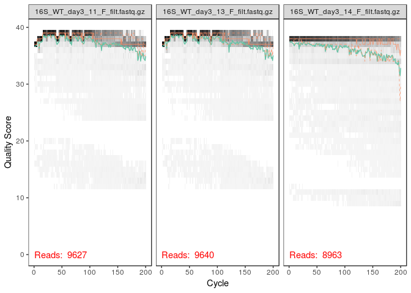<!-- -->
 


## Dereplication 

Combines all identical sequencing reads into "unique sequences" with a corresponding "abundance": the number of reads with that unique sequence

dereplication substantially reduces computation time by eliminating redundant comparisons

- DADA2 retains a summary of the quality information associated with each unique sequence

the consensus quality profile of a unique sequence is the average of the positional qualities from the dereplicated reads.
These quality profiles inform the error model of the subsequent denosing step, significantly increasing DADA2's accuracy.


- Dereplicate the filtered fastq files:


```r
derepFs <- derepFastq(filt_FWs, verbose=TRUE)
```


-  Name the derep-class objects by the sample names 


```r
names(derepFs) <- sample.ids
```


## Sample Inference

- Apply the core sequence-variant inference algorithm to the dereplicated data

Infer the sequence variants in each sample


```r
dadaFs <- dada(derepFs, err= err, multithread = TRUE)
```

```
## Sample 1 - 9627 reads in 1844 unique sequences.
## Sample 2 - 9640 reads in 1523 unique sequences.
## Sample 3 - 8963 reads in 2665 unique sequences.
## Sample 4 - 9491 reads in 1480 unique sequences.
## Sample 5 - 9608 reads in 1698 unique sequences.
## Sample 6 - 9503 reads in 3334 unique sequences.
## Sample 7 - 9446 reads in 3337 unique sequences.
## Sample 8 - 9544 reads in 3463 unique sequences.
## Sample 9 - 9515 reads in 3402 unique sequences.
## Sample 10 - 9494 reads in 3320 unique sequences.
```


Inspecting the dada-class object returned by dada:


```r
dadaFs[[1]]
```

```
## dada-class: object describing DADA2 denoising results
## 84 sequence variants were inferred from 1844 input unique sequences.
## Key parameters: OMEGA_A = 1e-40, OMEGA_C = 1e-40, BAND_SIZE = 16
```


 
  ## Construct sequence table
  
construct a sequence table of our samples, a higher resolution version of the OTU table produced by traditional methods


```r
seqtab <- makeSequenceTable(dadaFs)
seqtab.sep <- removeBimeraDenovo(seqtab, multithread=TRUE)

dim(seqtab)
```

```
## [1]  10 613
```


-  Inspecting distribution of sequence lengths:


```r
table(nchar(getSequences(seqtab)))
```

```
## 
## 200 
## 613
```

the sequence table is a matrix with rows corresponding to (and named by) the sequence variants. 

- Remove chimeras

The core dada method removes substitution and indel errors, but chimeras remain.

Remove chimeric sequences:
     

```r
seqtab.nochim <- removeBimeraDenovo(seqtab, method="consensus", multithread =TRUE, verbose=TRUE)
```

```
## Identified 74 bimeras out of 613 input sequences.
```

```r
dim(seqtab.nochim)
```

```
## [1]  10 539
```

```r
sum(seqtab.nochim) / sum(seqtab)
```

```
## [1] 0.9222373
```


## Assign Taxonomy


It is common at this point, especially in 16S/18S/ITS, to classify sequence variants taxonomically

DADA2 provides a native implementation of THE RDP'S NAIVE BAYESIAN CLASSIFIER for this purpose. 

The assignTaxonomy function takes a set sequences and a training set of taxonomically classified sequences, and outputs the taxonomic assignments:

  
- To follow along, check you have: 

silva_nr_v128_train_set.fa.gz file 

placed in the directory with the fastq files


```r
taxa <- assignTaxonomy(seqtab.nochim, paste(path.16S, "/silva_nr_v128_train_set.fa.gz", sep=""), multithread = TRUE)
```

- We can also use the greengenes database to assign taxonomy, downloading the 

gg_13_8_train_set_97.fa.gz file:


```r
  taxa_gg97 <- assignTaxonomy(seqtab.nochim, paste(path.16S, "/gg_13_8_train_set_97.fa.gz", sep=""), multithread = TRUE)
```


- optional --> the dada2package also implements a method to make SPECIES LEVEL ASSIGNMENTS BASED ON EXACT MATCHING between ASVs and sequenced reference strains.

Currently species-assignment training fastas are available for the Silva and RDP 16S databases

-To follow the optional species addition step, download the 

silva_species_assignment_v128.fa.gz file, 
and place it in the directory with the fastq files.


```r
taxa <- addSpecies(taxa, paste(path.16S, "/silva_species_assignment_v128.fa.gz", sep=""))
```


# HERE ENDS THE DADA2 R PACKAGE USE.
# PHYLOSEQ R PACKAGE FOR ANALYSIS OF THE DATA

 Phyloseq R package is a powerful framework for further analysis of microbiome data.

  Import the tables produced by the DADA2 pipeline into phyloseq
  
  Add metadata of your data: 
       


-Import into phyloseq

We can construct a simple sample data.frame based on the filenames.

Usually this step would instead involve reading the sample data in from a file

1) getting the sample-names, and category 


```r
samples.out <- rownames(seqtab.nochim)
samples.out
```

```
##  [1] "16S_WT_day3_11" "16S_WT_day3_13" "16S_WT_day3_14" "16S_WT_day3_15"
##  [5] "16S_WT_day3_9"  "16S_WT_unt_1"   "16S_WT_unt_2"   "16S_WT_unt_3"  
##  [9] "16S_WT_unt_4"   "16S_WT_unt_7"
```

```r
namesamp <- sapply(strsplit(samples.out, "WT_"), `[`, 2)
namesamp
```

```
##  [1] "day3_11" "day3_13" "day3_14" "day3_15" "day3_9"  "unt_1"   "unt_2"  
##  [8] "unt_3"   "unt_4"   "unt_7"
```

```r
antibioticUsage <- sapply(strsplit(namesamp, "_"), '[', 1)
antibioticUsage
```

```
##  [1] "day3" "day3" "day3" "day3" "day3" "unt"  "unt"  "unt"  "unt"  "unt"
```


2) Constructing the data-frame 


```r
samdf <- data.frame(AntibioticUsage=antibioticUsage)
samdf$antibiotic[samdf$AntibioticUsage=="unt"] <- "unt"
samdf$antibiotic[samdf$AntibioticUsage=="day3"] <- "Streptomycine"

rownames(samdf) <- samples.out
samdf
```

```
##                AntibioticUsage    antibiotic
## 16S_WT_day3_11            day3 Streptomycine
## 16S_WT_day3_13            day3 Streptomycine
## 16S_WT_day3_14            day3 Streptomycine
## 16S_WT_day3_15            day3 Streptomycine
## 16S_WT_day3_9             day3 Streptomycine
## 16S_WT_unt_1               unt           unt
## 16S_WT_unt_2               unt           unt
## 16S_WT_unt_3               unt           unt
## 16S_WT_unt_4               unt           unt
## 16S_WT_unt_7               unt           unt
```


- We can now construct a phyloseq object directly from the dada2 outputs


```r
ps <- phyloseq(otu_table(seqtab.nochim, taxa_are_rows = FALSE),
               sample_data(samdf),
               tax_table(taxa))
ps
```

```
## phyloseq-class experiment-level object
## otu_table()   OTU Table:         [ 539 taxa and 10 samples ]
## sample_data() Sample Data:       [ 10 samples by 2 sample variables ]
## tax_table()   Taxonomy Table:    [ 539 taxa by 7 taxonomic ranks ]
```


- Optionally, we can also do an object for the taxa assignment with greengenes db: 


```r
ps_gg <- phyloseq(otu_table(seqtab.nochim, taxa_are_rows = FALSE),
               sample_data(samdf),
               tax_table(taxa_gg97))
ps_gg
```

```
## phyloseq-class experiment-level object
## otu_table()   OTU Table:         [ 539 taxa and 10 samples ]
## sample_data() Sample Data:       [ 10 samples by 2 sample variables ]
## tax_table()   Taxonomy Table:    [ 539 taxa by 7 taxonomic ranks ]
```


## Ready to use phyloseq!!

rarefaction of ps otu tables: we make a copy of the ps objects:


```r
depth_raref <- min(sample_sums(ps))
ps_raref <- rarefy_even_depth(ps, sample.size=depth_raref)
```

```
## You set `rngseed` to FALSE. Make sure you've set & recorded
##  the random seed of your session for reproducibility.
## See `?set.seed`
```

```
## ...
```

```r
ps_gg_raref <- rarefy_even_depth(ps_gg, sample.size=depth_raref)
```

```
## You set `rngseed` to FALSE. Make sure you've set & recorded
##  the random seed of your session for reproducibility.
## See `?set.seed`
## 
## ...
```

```
## 2OTUs were removed because they are no longer 
## present in any sample after random subsampling
```

```
## ...
```
### visualizations with Phyloseq: 

#### Visualizing alpha-diversity  


```r
plot_richness(ps, measures = c("Shannon","Observed", "Chao1"), color = "antibiotic") + theme_bw() + theme(axis.text.x = element_text(angle=90, hjust =1))
```

```
## Warning in estimate_richness(physeq, split = TRUE, measures = measures): The data you have provided does not have
## any singletons. This is highly suspicious. Results of richness
## estimates (for example) are probably unreliable, or wrong, if you have already
## trimmed low-abundance taxa from the data.
## 
## We recommended that you find the un-trimmed data and retry.
```

```
## Warning: Removed 20 rows containing missing values (geom_errorbar).
```

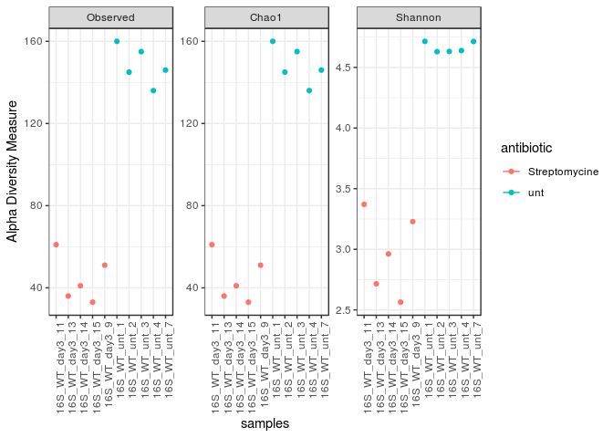<!-- -->

- We observe obvious systematic difference in alpha-diversity between treated and untreated samples


#### Bar plots  


```r
par(mfrow=c(2,3))

plot_bar(ps,  fill="Phylum") + facet_wrap(~antibiotic, scales="free_x") + labs(title = "Level Phylum" )
```

<!-- -->

```r
plot_bar(ps,  fill="Class") + facet_wrap(~antibiotic, scales="free_x") + labs(title = "Level Class" )
```

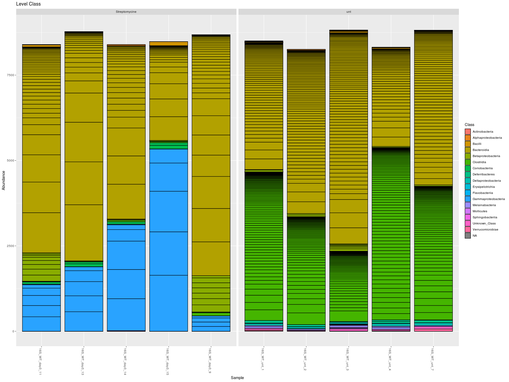<!-- -->

```r
plot_bar(ps,  fill="Order") + facet_wrap(~antibiotic, scales="free_x") + labs(title = "Level Order" )
```

<!-- -->

```r
plot_bar(ps,  fill="Family") + facet_wrap(~antibiotic, scales="free_x") + labs(title = "Level Family" )
```

<!-- -->

```r
plot_bar(ps,  fill="Genus") + facet_wrap(~antibiotic, scales="free_x") + labs(title = "Level Genus" )
```

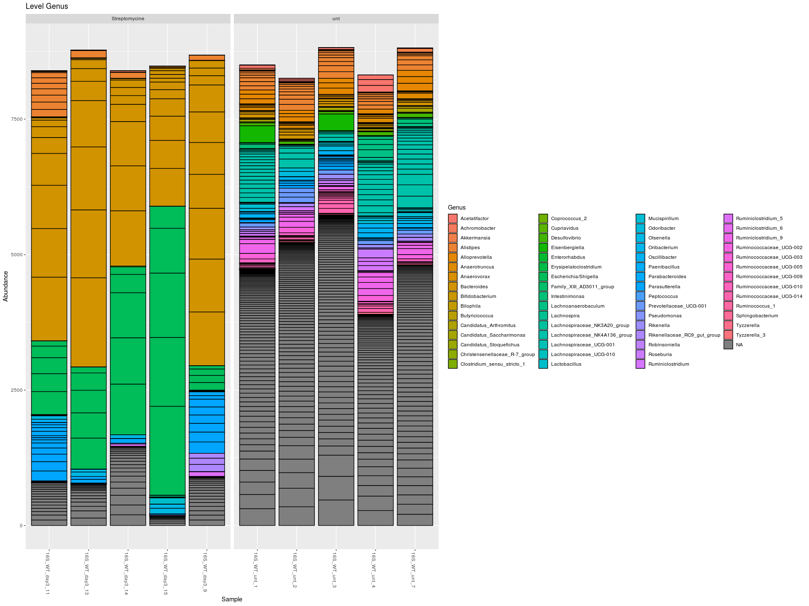<!-- -->

```r
plot_bar(ps,  fill="Species") + facet_wrap(~antibiotic, scales="free_x") + labs(title = "Level Species" )
```

<!-- -->


##  Summarize alpha diversity

Estimate richness: 

- Performs a number of standard alpha diversity estimates, and returns the results as a data.frame. 


```r
richness_estimate_raref <- estimate_richness(ps_raref, split= TRUE, measures = NULL)
richness_estimate_raref
```

```
##                 Observed Chao1  se.chao1       ACE    se.ACE  Shannon
## X16S_WT_day3_11       61  61.0 0.4958847  61.29133 2.4094182 3.349961
## X16S_WT_day3_13       36  36.0 0.0000000  36.00000 0.9860133 2.733323
## X16S_WT_day3_14       41  41.0 0.4938648  41.51953 1.6330420 2.941238
## X16S_WT_day3_15       33  33.0 0.0000000  33.00000 1.6514456 2.575778
## X16S_WT_day3_9        51  51.0 0.0000000  51.00000 2.3008950 3.223640
## X16S_WT_unt_1        159 159.0 0.0000000 159.00000 4.3538460 4.695880
## X16S_WT_unt_2        145 145.0 0.0000000 145.00000 3.6671891 4.624234
## X16S_WT_unt_3        155 155.5 1.2976450 155.43812 4.2161139 4.619899
## X16S_WT_unt_4        136 136.0 0.0000000 136.00000 3.1796689 4.634317
## X16S_WT_unt_7        146 146.0 0.2491424 146.23843 3.4159445 4.707129
##                   Simpson InvSimpson    Fisher
## X16S_WT_day3_11 0.9417671  17.172409  8.931395
## X16S_WT_day3_13 0.9031036  10.320297  4.837005
## X16S_WT_day3_14 0.9244934  13.243879  5.622405
## X16S_WT_day3_15 0.8921072   9.268457  4.374934
## X16S_WT_day3_9  0.9392114  16.450448  7.245528
## X16S_WT_unt_1   0.9875552  80.354783 27.934725
## X16S_WT_unt_2   0.9864786  73.956736 24.987094
## X16S_WT_unt_3   0.9850477  66.879224 27.085552
## X16S_WT_unt_4   0.9881356  84.285671 23.129098
## X16S_WT_unt_7   0.9891234  91.940506 25.195346
```


## Comparing matrixes


###  Calculate unweighted UniFrac distance for all sample pairs.

This function calculates the (Fast) UniFrac distance for all sample-pairs in a phyloseq-class object. We will use the phyloseq-class object with the rarefied otu table.


```r
DistUniFrac_dada2_ape <- UniFrac(ps_copy2, weighted=FALSE, normalized=TRUE, parallel=FALSE, fast=TRUE)
```
The package vegan is used to compare matrixes. 


Path with path where our tables are: 


```r
dm_tables_path <- "./COMPARING_DM/"

#check if path and data included are ok: 
list.files(dm_tables_path)
```

```
## [1] "Mantel_Bray_Results.csv"    "Mantel_Unifrac_Results.csv"
## [3] "q1_Md_Unifrac_dm.txt"       "Q2_bray.tsv"               
## [5] "q2_Md_Unifrac_dm.tsv"
```

Importing to R the unweighted unifrac distance matrixes of Q1 and Q2:


```r
dm_qiime1 <- read.table(paste(dm_tables_path, "q1_Md_Unifrac_dm.txt", sep=""))

dm_qiime2 <- read.table(paste(dm_tables_path,"/q2_Md_Unifrac_dm.tsv", sep=""))
```

samples in the matrix must be equally sorted: 


```r
dm_qiime1_sorted <- dm_qiime1[order(rownames(dm_qiime1), decreasing=TRUE),order(colnames(dm_qiime1), decreasing =TRUE)]
dm_qiime2_sorted <- dm_qiime2[order(rownames(dm_qiime2), decreasing=TRUE),order(colnames(dm_qiime2), decreasing =TRUE)]
```

DADA2 Unifrac Matrixes: 
DistUniFrac_dada2_ape and DistUnifrac_dada2_Q2 are objects type "dist" (distance).

```r
class(DistUniFrac_dada2_ape)
```

```
## [1] "dist"
```


We will transform them into matrixes objects, and then into dataframes:


```r
my_DistUniFrac_ape <- as.matrix(DistUniFrac_dada2_ape, nrow=10, ncol=10)

class(my_DistUniFrac_ape)
```

```
## [1] "matrix"
```

```r
dada2_Unifrac_ape <- as.data.frame(my_DistUniFrac_ape)

class(dada2_Unifrac_ape)
```

```
## [1] "data.frame"
```


Mantel Test for Matrixes Comparison:

[Click here for info](https://mb3is.megx.net/gustame/hypothesis-tests/the-mantel-test)


```r
q1vsq2_P <- mantel(dm_qiime1_sorted, dm_qiime2_sorted, method="pearson", permutations=999)
q1vsdada2_ape_P <- mantel(dm_qiime1_sorted, dada2_Unifrac_ape, method="pearson", permutations=999)
q2vsdada2_ape_P <- mantel(dm_qiime2_sorted, dada2_Unifrac_ape, method="pearson", permutations=999)
```


```r
q1vsq2_S <- mantel(dm_qiime1_sorted, dm_qiime2_sorted, method="spearman", permutations=999)
q1vsdada2_ape_S <- mantel(dm_qiime1_sorted, dada2_Unifrac_ape, method="spearman", permutations=999)
q2vsdada2_ape_S <- mantel(dm_qiime2_sorted, dada2_Unifrac_ape, method="spearman", permutations=999)
```


```r
mantelsummary <- read.csv("./COMPARING_DM/Mantel_Unifrac_Results.csv")
mantelsummary
```

```
##         Pearson Method Q1        Q2     DADA2
## 1             r     Q1     0.776836  0.803325
## 2  significance               0.004     0.007
## 3             r     Q2              0.8057842
## 4  significance                         0.008
## 5                                            
## 6      Spearman        Q1        Q2     DADA2
## 7             r     Q1    0.6794466 0.7566535
## 8  significance               0.008     0.001
## 9             r     Q2              0.6915679
## 10 significance                         0.006
```


### comparing Bray Curtis matrixes

Import Q1 otu table, to produce the bray_curtis with phyloseq and check if its the same than the produced with q1 in the terminal


```r
q1_otu_table <- import_biom("./QIIMEI/otus/otu_table_mc2_w_tax_no_pynast_failures.biom")
```

```
## Warning in strsplit(conditionMessage(e), "\n"): input string 1 is invalid
## in this locale
```

```r
# Make it from Rarefied cdout/table_7786 algo (comprobar) 
q1_otu_table_raref <- import_biom("./QIIMEI/cdout/table_even7786.biom")
```

```
## Warning in strsplit(conditionMessage(e), "\n"): input string 1 is invalid
## in this locale
```

```r
q1_bray_dm <- phyloseq::distance(q1_otu_table, method="bray")     #q1_bray_dm is a "dist" type object.
q1_bray_dm_raref <- phyloseq::distance(q1_otu_table_raref, method="bray")
class(q1_bray_dm)
```

```
## [1] "dist"
```

```r
class(q1_bray_dm_raref)                            
```

```
## [1] "dist"
```


the core_metrics diversity in Q1 doesn't give the beta_diversity metrics, we can obtain it with beta_diversity.py
from the rarefied otu table: 


we can include metadata


```bash

$QIIME1
biom convert -i $PATH_Q1/cdout/table_even7786.biom -o $PATH_Q1/tablefrom_table_even7786_with_taxonomy.txt --to-tsv --header-key taxonomy

```

bray_curtis in the terminal with Q1:


```bash

$QIIME1
beta_diversity.py -i $PATH_Q1/cdout/table_even7786.biom -m bray_curtis -o $PATH_Q1/beta_diversity_raref

```


### Import to R  Bray matrixes done in Q1 and Q2


```r
q1_bray_raref_imported <- read.table("./QIIMEI/beta_diversity_raref/bray_curtis_table_even7786.txt")
```


```r
q2_bray_dm <- read.table("./COMPARING_DM/Q2_bray.tsv")
```


```r
dada2_bray <-phyloseq::distance(ps_raref, method = "bray")
class(dada2_bray)
```

```
## [1] "dist"
```

```r
my_dada2_bray_matrix <- as.matrix(dada2_bray, nrow=10, ncol=10)
class(my_dada2_bray_matrix)
```

```
## [1] "matrix"
```

```r
dada2_bray_dm <- as.data.frame(my_dada2_bray_matrix)
class(dada2_bray_dm)
```

```
## [1] "data.frame"
```


```r
#We need to replace the "_" for "." so the format of labels are the same in all tables.
colnames(bray_dada2_sorted)
```

```
##  [1] "16S_WT_unt_7"   "16S_WT_unt_4"   "16S_WT_unt_3"   "16S_WT_unt_2"  
##  [5] "16S_WT_unt_1"   "16S_WT_day3_9"  "16S_WT_day3_15" "16S_WT_day3_14"
##  [9] "16S_WT_day3_13" "16S_WT_day3_11"
```

```r
colnames(bray_dada2_sorted) = gsub("16S_", "", colnames(bray_dada2_sorted))

colnames(bray_dada2_sorted)= gsub("_",".", colnames(bray_dada2_sorted))

rownames(bray_dada2_sorted) = gsub("16S_", "", rownames(bray_dada2_sorted))

rownames(bray_dada2_sorted)= gsub("_",".", rownames(bray_dada2_sorted))
```


Comparing Bray Matrixes: 


```r
Bray_q1vsq2_P <- mantel(bray_q1_sorted, bray_q2_sorted, method="pearson", permutations=999)

Bray_q1vsdada2_P <- mantel(bray_q1_sorted, bray_dada2_sorted, method="pearson", permutations=999)

Bray_q2vsdada2_P <- mantel(bray_q2_sorted, bray_dada2_sorted, method="pearson", permutations=999)
```


```r
Bray_q1vsq2_S <- mantel(bray_q1_sorted, bray_q2_sorted, method="spearman", permutations=999)

Bray_q1vsdada2_S <- mantel(bray_q1_sorted, bray_dada2_sorted, method="spearman", permutations=999)

Bray_q2vsdada2_S <- mantel(bray_q2_sorted, bray_dada2_sorted, method="spearman", permutations=999)
```


# Comparing Alpha_Diversity in Q1, Q2 and DADA2


Plotting the Q1 alpha diversity indexes:


```r
ggplot(my_Q1_alpha_diversity, aes(AntibioticUsage, my_Q1_alpha_diversity$chao1))+
  geom_dotplot(aes(x=AntibioticUsage, 
                   y=chao1, 
                   fill=AntibioticUsage,
                   col=AntibioticUsage),
               
               #show.legend = FALSE,
               binaxis="y",
               stackdir ="center", dotsize = 1)+
  geom_boxplot(alpha=.3, 
                outlier.shape=20, outlier.color="red", 
                outlier.size=4)+
  ylab("Chao1") + theme(panel.background = NULL)
```

```
## `stat_bindot()` using `bins = 30`. Pick better value with `binwidth`.
```

<!-- -->

```r
ggplot(my_Q1_alpha_diversity, aes(AntibioticUsage, my_Q1_alpha_diversity$shannon))+
  geom_dotplot(aes(x=AntibioticUsage, 
                   y=shannon, 
                   fill=AntibioticUsage,
                   col=AntibioticUsage),
               
               #show.legend = FALSE,
               binaxis="y",
               stackdir ="center", dotsize = 1)+
  geom_boxplot(alpha=.3, 
                outlier.shape=20, outlier.color="red", 
                outlier.size=4)+
  ylab("Shannon") + theme(panel.background = NULL)
```

```
## `stat_bindot()` using `bins = 30`. Pick better value with `binwidth`.
```

<!-- -->

```r
ggplot(my_Q1_alpha_diversity, aes(AntibioticUsage, my_Q1_alpha_diversity$observed_otus))+
  geom_dotplot(aes(x=AntibioticUsage, 
                   y=observed_otus, 
                   fill=AntibioticUsage,
                   col=AntibioticUsage),
               
               #show.legend = FALSE,
               binaxis="y",
               stackdir ="center", dotsize = 1)+
  geom_boxplot(alpha=.3, 
                outlier.shape=20, outlier.color="red", 
                outlier.size=4)+
  ylab("Observed OTUs") + theme(panel.background = NULL)
```

```
## `stat_bindot()` using `bins = 30`. Pick better value with `binwidth`.
```

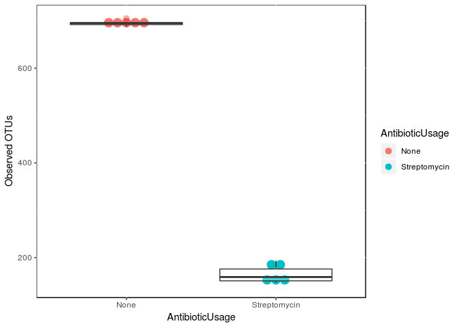<!-- -->

```r
ggplot(my_Q1_alpha_diversity, aes(AntibioticUsage, my_Q1_alpha_diversity$PD_whole_tree))+
  geom_dotplot(aes(x=AntibioticUsage, 
                   y=PD_whole_tree, 
                   fill=AntibioticUsage,
                   col=AntibioticUsage),
               
               #show.legend = FALSE,
               binaxis="y",
               stackdir ="center", dotsize = 1)+
  geom_boxplot(alpha=.3, 
                outlier.shape=20, outlier.color="red", 
                outlier.size=4)+
  ylab("Faith PD") + theme(panel.background = NULL)
```

```
## `stat_bindot()` using `bins = 30`. Pick better value with `binwidth`.
```

<!-- -->


- Importing Q2 data


Alpha diversity measures in Q2 were calculated and exported from visualization.qzv object, we first exported it to get the table with the alpha diversity index, and then import it to R with the following:


```r
Q2_mi_alpha_diversity <- read.table("./QIIME2/alpha_Q2.csv", header=TRUE)
```


Plotting the Q2 alpha diversity indexes:


```r
ggplot(Q2_mi_alpha_diversity, aes(AntibioticUsage, Q2_mi_alpha_diversity$chao1))+
  geom_dotplot(aes(x=AntibioticUsage, 
                   y=chao1, 
                   fill=AntibioticUsage,
                   col=AntibioticUsage),
               
               #show.legend = FALSE,
               binaxis="y",
               stackdir ="center", dotsize = 1)+
  geom_boxplot(alpha=.3, 
                outlier.shape=20, outlier.color="red", 
                outlier.size=4)+
  ylab("Chao1") + theme(panel.background = NULL)
```

```
## `stat_bindot()` using `bins = 30`. Pick better value with `binwidth`.
```

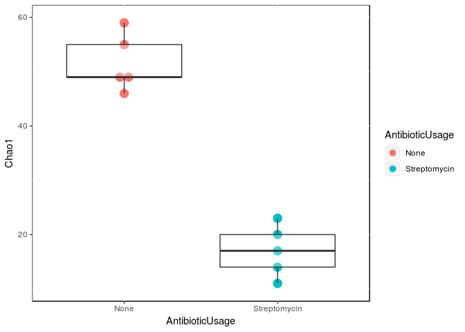<!-- -->

```r
ggplot(Q2_mi_alpha_diversity, aes(AntibioticUsage, Q2_mi_alpha_diversity$Shannon))+
  geom_dotplot(aes(x=AntibioticUsage, 
                   y=Shannon, 
                   fill=AntibioticUsage,
                   col=AntibioticUsage),
               
               #show.legend = FALSE,
               binaxis="y",
               stackdir ="center", dotsize = 1)+
  geom_boxplot(alpha=.3, 
                outlier.shape=20, outlier.color="red", 
                outlier.size=4)+
  ylab("Shannon") + theme(panel.background = NULL)
```

```
## `stat_bindot()` using `bins = 30`. Pick better value with `binwidth`.
```

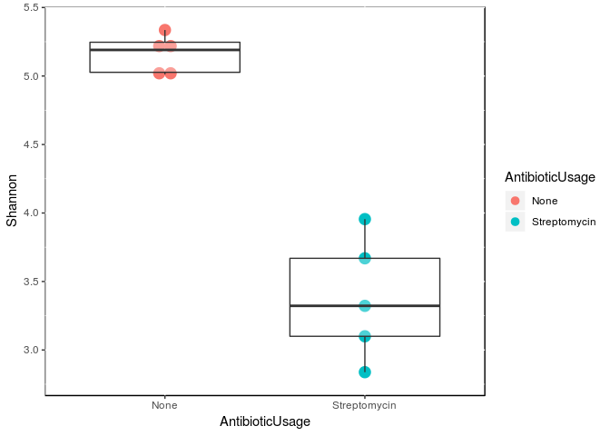<!-- -->

```r
ggplot(Q2_mi_alpha_diversity, aes(AntibioticUsage, Q2_mi_alpha_diversity$observed_otus))+
  geom_dotplot(aes(x=AntibioticUsage, 
                   y=observed_otus, 
                   fill=AntibioticUsage,
                   col=AntibioticUsage),
               
               #show.legend = FALSE,
               binaxis="y",
               stackdir ="center", dotsize = 1)+
  geom_boxplot(alpha=.3, 
                outlier.shape=20, outlier.color="red", 
                outlier.size=4)+
  ylab("Observed OTUs") + theme(panel.background = NULL)
```

```
## `stat_bindot()` using `bins = 30`. Pick better value with `binwidth`.
```

<!-- -->

```r
ggplot(Q2_mi_alpha_diversity, aes(AntibioticUsage, Q2_mi_alpha_diversity$faith_PD))+
  geom_dotplot(aes(x=AntibioticUsage, 
                   y=faith_PD, 
                   fill=AntibioticUsage,
                   col=AntibioticUsage),
               
               #show.legend = FALSE,
               binaxis="y",
               stackdir ="center", dotsize = 1)+
  geom_boxplot(alpha=.3, 
                outlier.shape=20, outlier.color="red", 
                outlier.size=4)+
  ylab("Faith PD") + theme(panel.background = NULL)
```

```
## `stat_bindot()` using `bins = 30`. Pick better value with `binwidth`.
```

<!-- -->


DADA2 Alpha diversity

We  already have the dataframe from "estimate richness"" command of phyloseq
Let's create a copy of it to work from now and on:


```r
Dada2_alpha_diversity <- richness_estimate

#comparison of alpha diversity using richness estimated from ps object with rarefied OTU table: 

Dada2_alpha_diversity_raref <- richness_estimate_raref
```

The alpha_diversity indexes obtained, are very similar, but we will go on with the results obtained using the rarefacted OTU_table, for better homogeneity in the procedures with Q1 and Q2

lets add the factor Antibiotic Usage column:


```r
#creating the new column

#just in case we didnt do this before and is not in our environment)
Category <- c("Streptomycin", "Streptomycin", "None", "None", "None", "None", "None", "Streptomycin", "Streptomycin", "Streptomycin")

#or we can paste it from Q2 dataframe to the dada2 dataframe
Dada2_alpha_diversity_raref$AntibioticUsage <- Q2_mi_alpha_diversity$AntibioticUsage
Dada2_alpha_diversity_raref
```

```
##                 Observed Chao1  se.chao1       ACE    se.ACE  Shannon
## X16S_WT_day3_11       61  61.0 0.4958847  61.29133 2.4094182 3.349961
## X16S_WT_day3_13       36  36.0 0.0000000  36.00000 0.9860133 2.733323
## X16S_WT_day3_14       41  41.0 0.4938648  41.51953 1.6330420 2.941238
## X16S_WT_day3_15       33  33.0 0.0000000  33.00000 1.6514456 2.575778
## X16S_WT_day3_9        51  51.0 0.0000000  51.00000 2.3008950 3.223640
## X16S_WT_unt_1        159 159.0 0.0000000 159.00000 4.3538460 4.695880
## X16S_WT_unt_2        145 145.0 0.0000000 145.00000 3.6671891 4.624234
## X16S_WT_unt_3        155 155.5 1.2976450 155.43812 4.2161139 4.619899
## X16S_WT_unt_4        136 136.0 0.0000000 136.00000 3.1796689 4.634317
## X16S_WT_unt_7        146 146.0 0.2491424 146.23843 3.4159445 4.707129
##                   Simpson InvSimpson    Fisher AntibioticUsage
## X16S_WT_day3_11 0.9417671  17.172409  8.931395    Streptomycin
## X16S_WT_day3_13 0.9031036  10.320297  4.837005    Streptomycin
## X16S_WT_day3_14 0.9244934  13.243879  5.622405    Streptomycin
## X16S_WT_day3_15 0.8921072   9.268457  4.374934    Streptomycin
## X16S_WT_day3_9  0.9392114  16.450448  7.245528    Streptomycin
## X16S_WT_unt_1   0.9875552  80.354783 27.934725            None
## X16S_WT_unt_2   0.9864786  73.956736 24.987094            None
## X16S_WT_unt_3   0.9850477  66.879224 27.085552            None
## X16S_WT_unt_4   0.9881356  84.285671 23.129098            None
## X16S_WT_unt_7   0.9891234  91.940506 25.195346            None
```


Plotting the DADA2 alpha diversity indexes:


```r
ggplot(Dada2_alpha_diversity_raref, aes(AntibioticUsage, Dada2_alpha_diversity_raref$Chao1))+
  geom_dotplot(aes(x=AntibioticUsage, 
                   y=Chao1, 
                   fill=AntibioticUsage,
                   col=AntibioticUsage),
               
               #show.legend = FALSE,
               binaxis="y",
               stackdir ="center", dotsize = 1)+
  geom_boxplot(alpha=.3, 
                outlier.shape=20, outlier.color="red", 
                outlier.size=4)+
  ylab("Chao1") + theme(panel.background = NULL)
```

```
## `stat_bindot()` using `bins = 30`. Pick better value with `binwidth`.
```

<!-- -->

```r
ggplot(Dada2_alpha_diversity_raref, aes(AntibioticUsage, Dada2_alpha_diversity_raref$Shannon))+
  geom_dotplot(aes(x=AntibioticUsage, 
                   y=Shannon, 
                   fill=AntibioticUsage,
                   col=AntibioticUsage),
               
               #show.legend = FALSE,
               binaxis="y",
               stackdir ="center", dotsize = 1)+
  geom_boxplot(alpha=.3, 
                outlier.shape=20, outlier.color="red", 
                outlier.size=4)+
  ylab("Shannon") + theme(panel.background = NULL)
```

```
## `stat_bindot()` using `bins = 30`. Pick better value with `binwidth`.
```

<!-- -->

```r
ggplot(Dada2_alpha_diversity_raref, aes(AntibioticUsage, Dada2_alpha_diversity_raref$Observed))+
  geom_dotplot(aes(x=AntibioticUsage, 
                   y=Observed, 
                   fill=AntibioticUsage,
                   col=AntibioticUsage),
               
               #show.legend = FALSE,
               binaxis="y",
               stackdir ="center", dotsize = 1)+
  geom_boxplot(alpha=.3, 
                outlier.shape=20, outlier.color="red", 
                outlier.size=4)+
  ylab("Observed OTUs") + theme(panel.background = NULL)
```

```
## `stat_bindot()` using `bins = 30`. Pick better value with `binwidth`.
```

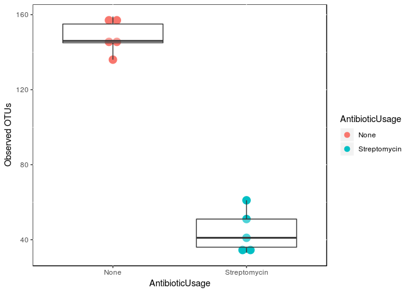<!-- -->

```r
ggplot(Dada2_alpha_diversity_raref, aes(AntibioticUsage, Dada2_alpha_diversity_raref$faith_pd))+
  geom_dotplot(aes(x=AntibioticUsage, 
                   y=faith_pd, 
                   fill=AntibioticUsage,
                   col=AntibioticUsage),
               
               #show.legend = FALSE,
               binaxis="y",
               stackdir ="center", dotsize = 1)+
  geom_boxplot(alpha=.3, 
                outlier.shape=20, outlier.color="red", 
                outlier.size=4)+
  ylab("Faith PD") + theme(panel.background = NULL)
```

```
## `stat_bindot()` using `bins = 30`. Pick better value with `binwidth`.
```

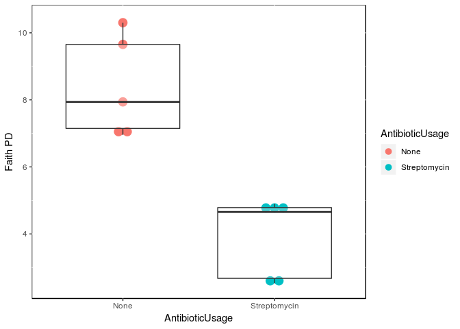<!-- -->


We will now test the differences between the Antibiotic Usage groups, performing the Wilcoxon test


## Comparing the taxonomic assignments among the different softwares

- Q1 uses an open-reference OTU picking process, reads are clustered against a reference sequence collection and any reads which do not hit the reference sequence collection are subsequently clustered de novo 

(*used the 97% GREEN-GENES database) 

- Q2: used DADA2 Amplicon Squence Variants. Later, the taxonomic assignment was performed with the classifier trained with 

Greengenes 13_8 99% OTUs full-length sequences

- Representing with Venn Diagrams the different methods detection of taxa among  taxonomic levels:

- DADA2: uses ASVs, taxonomic assignment vs Silva Reference

Build summary tables in OTU_SUMMARIES folder, and then: 


```r
grid.newpage()
plot(lv2,gp=gp2)
grid.text("Phylum", x=0.2, y=0.9)
```

<!-- -->

```r
grid.newpage()
plot(lv3, gp=gp3)
grid.text("Class", x=0.21, y=0.9)
```

<!-- -->

```r
grid.newpage()
plot(lv4, gp=gp4)
grid.text("Order", x=0.22, y=0.9)
```

<!-- -->

```r
grid.newpage()
plot(lv5, gp=gp5)
grid.text("Family", x=0.22, y=0.9)
```

<!-- -->

```r
grid.newpage()
plot(lv6, gp=gp6) 
grid.text("Genus", x=0.25, y=0.9)
```

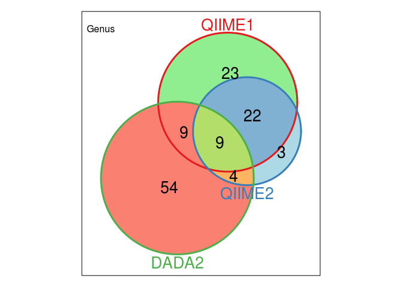<!-- -->

```r
grid.newpage()
plot(lv7, gp=gp7) 
grid.text("Species", x=0.25, y=0.9)
```

<!-- -->


##  bar plots of different taxas for each method


- Relative Freq: 


```r
#call the function while I set a variable for the plots product

my_plot_rel_func_mycolors <- function(my_df, title="") {
  ggplot(my_df, aes(x=Method, y=`Rel Freq`, fill=OTU_ID)) +
    geom_bar(stat='identity') +
    #theme(legend.position = "none") +
    theme(legend.key.size = unit(4, "mm"))+
    ggtitle(title)+ 
    ggplot2::scale_fill_manual(values=rep(c(mycolors), times=100))   

}

my_plot_rel_func_nolegend_mycolors <- function(my_df, title="") {
  ggplot(my_df, aes(x=Method, y=`Rel Freq`, fill=OTU_ID)) +
    theme(legend.position="none") + theme(panel.background = NULL) +
    geom_bar(stat='identity') +
    ggtitle(title) + 
    ggplot2::scale_fill_manual(values=rep(c(mycolors), times=100))   

}
  

plot_lv6_rel_custom <- my_plot_rel_func_mycolors(level6_rel_top10, title="Level 6: Top 10 Genus Relative Frequency")
plot_lv7_rel_custom <- my_plot_rel_func_mycolors(level7_rel_top10, title="Level 7: Top 10 Species Relative Frequency")
plot_lv5_rel_custom <- my_plot_rel_func_mycolors(level5_rel_top10, title="Level 5: Top 10 Family Relative Frequency")


plot_lv6_rel_nolegend_custom <- my_plot_rel_func_nolegend_mycolors (level6_rel_top10, title="Level 6: Top 10 Genus Relative Frequency")
plot_lv7_rel_nolegend_custom <- my_plot_rel_func_nolegend_mycolors (level7_rel_top10, title="Level 7: Top 10 Species Relative Frequency")
plot_lv5_rel_nolegend_custom <- my_plot_rel_func_nolegend_mycolors (level5_rel_top10, title="Level 5: Top 10 Family Relative Frequency")
plot_lv6_rel_custom
```

<!-- -->

```r
plot_lv7_rel_custom
```

<!-- -->

```r
plot_lv5_rel_custom
```

<!-- -->

```r
plot_lv6_rel_nolegend_custom
```

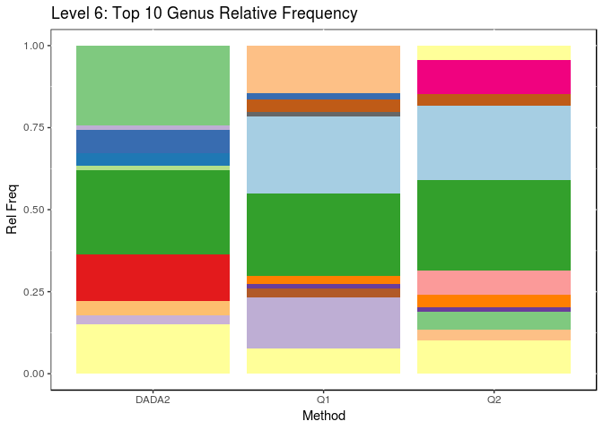<!-- -->

```r
plot_lv7_rel_nolegend_custom
```

<!-- -->

```r
plot_lv5_rel_nolegend_custom
```

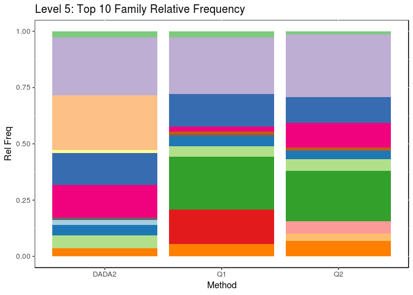<!-- -->


- Absolute Count for top10 taxa of each method:


```r
my_plot_abs_func <- function(my_df, title="") {
  ggplot(my_df, aes(x=my_df$OTU_ID, y=my_df$abs_Count)) + 
    scale_y_log10()+
    geom_bar(aes(fill = my_df$Method), 
             width = 0.4, position = position_dodge(width=0.5), stat="identity") +
    ggtitle(title)+
    theme(legend.position="top", legend.title = element_blank(),
          axis.title.x=element_blank(), 
          axis.title.y=element_blank(),
          axis.text.x=element_text(size=10,angle=90, hjust = 1),
          panel.background = NULL
    ) 
}

my_plot_abs_func_nolog <- function(my_df, title="") {
  ggplot(my_df, aes(x=my_df$OTU_ID, y=my_df$abs_Count)) + 
    #scale_y_log10()+
    geom_bar(aes(fill = my_df$Method), 
             width = 0.4, position = position_dodge(width=0.5), stat="identity") +
    ggtitle(title)+
    theme(legend.position="top", legend.title = element_blank(),
          axis.title.x=element_blank(), 
          axis.title.y=element_blank(),
          axis.text.x=element_text(size=10,angle=90, hjust = 1),
          panel.background = NULL
    ) 
}


#call the function while I set a variable for the plots product
plot_lv2_abs_top10 <- my_plot_abs_func(level2_abs_top10, title="Level 2: Phylum Absolute Count top10")
plot_lv3_abs_top10 <- my_plot_abs_func(level3_abs_top10, title="Level 3: Class Absolute Count top10")
plot_lv4_abs_top10 <- my_plot_abs_func(level4_abs_top10, title="Level 4: Order Absolute Count top10")
plot_lv5_abs_top10 <- my_plot_abs_func(level5_abs_top10, title="Level 5: Family Absolute Count top10")
plot_lv6_abs_top10 <- my_plot_abs_func(level6_abs_top10, title="Level 6: Genus Absolute Count top10")
plot_lv7_abs_top10 <- my_plot_abs_func(level7_abs_top10, title="Level 7: Species Absolute Count top10")

#nolog
plot_lv6_abs_top10_nolog <- my_plot_abs_func_nolog(level6_abs_top10, title="Level 6: Genus Absolute Count top10")
plot_lv7_abs_top10_nolog <- my_plot_abs_func_nolog(level7_abs_top10, title="Level 7: Species Absolute Count top10")


plot_lv2_abs_top10
```

```
## Warning: Transformation introduced infinite values in continuous y-axis
```

<!-- -->

```r
plot_lv3_abs_top10
```

<!-- -->

```r
plot_lv4_abs_top10
```

<!-- -->

```r
plot_lv5_abs_top10
```

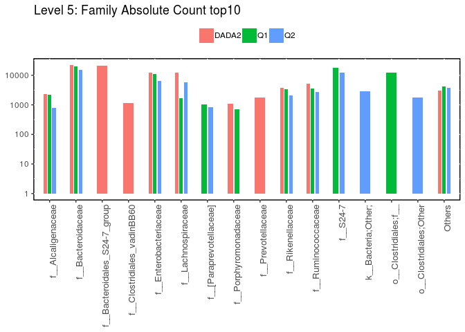<!-- -->

```r
plot_lv6_abs_top10
```

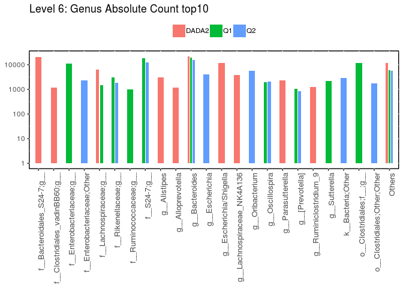<!-- -->

```r
plot_lv7_abs_top10
```

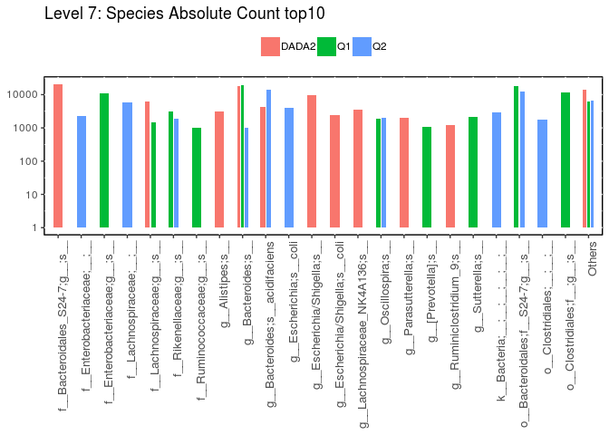<!-- -->

```r
plot_lv6_abs_top10_nolog
```

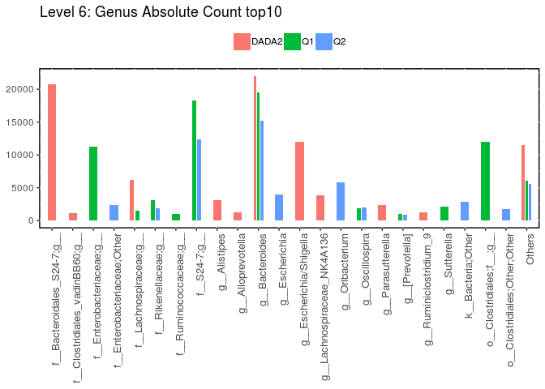<!-- -->

```r
plot_lv7_abs_top10_nolog
```

<!-- -->

```r
#log10(0) = - infinite thats why the scale is not adjusted in Unassigned values.
```


- plotting Unifrac DM PCoA 


```r
PCOA_plot_qiime2(mapping_file, OTU_table_qiime2, unw_unifrac_dm_qiime2, "Unweighted Unifrac PCoA QIIME2")
```

<!-- -->

```r
PCOA_plot_qiime2(mapping_file, OTU_table_qiime1, unw_unifrac_dm_qiime1, "Unweighted Unifrac PCoA QIIMEI")
```

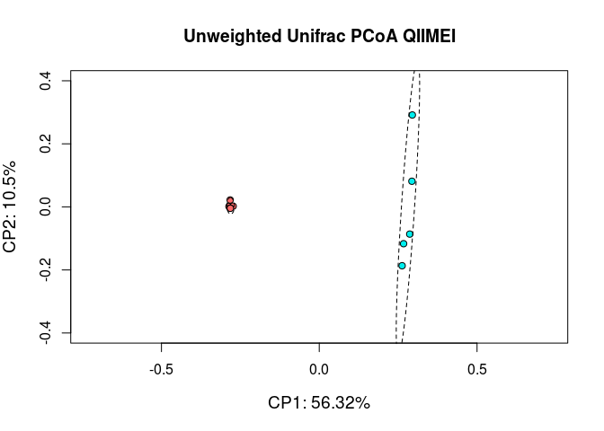<!-- -->

```r
PCOA_plot_qiime2(mapping_file, OTU_table_DADA2,  unw_unifrac_dm_dada2, "Unweighted Unifrac PCoA DADA2")
```

<!-- -->

```r
PCOA_plot_qiime2(mapping_file, OTU_table_DADA2,  dada2_Unifrac_ape, "Unweighted Unifrac PCoA DADA2 (ape tree)")
```

<!-- -->


```r
PCOA_plot_qiime2_bray(mapping_file, OTU_table_qiime2, bray_q2, "Bray-Curtis PCoA QIIME2")
```

<!-- -->

```r
PCOA_plot_qiime2_bray(mapping_file, OTU_table_qiime1, bray_q1, "Bray-Curtis PCoA QIIMEI")
```

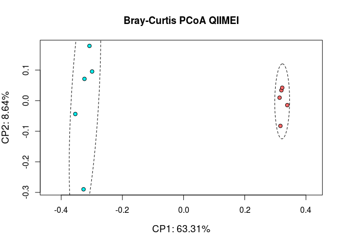<!-- -->

```r
PCOA_plot_qiime2_bray(mapping_file, OTU_table_DADA2,  bray_dada2, "Bray-Curtis PCoA DADA2")
```

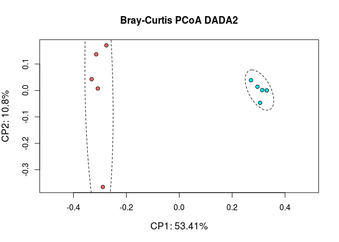<!-- -->


```r
PCOA_plot_legend(mapping_file, OTU_table_qiime2, bray_q2, "Bray-Curtis PCoA QIIME2")
```

<!-- -->

```r
PCOA_plot_legend(mapping_file, OTU_table_qiime1, bray_q1, "Bray-Curtis PCoA QIIMEI")
```

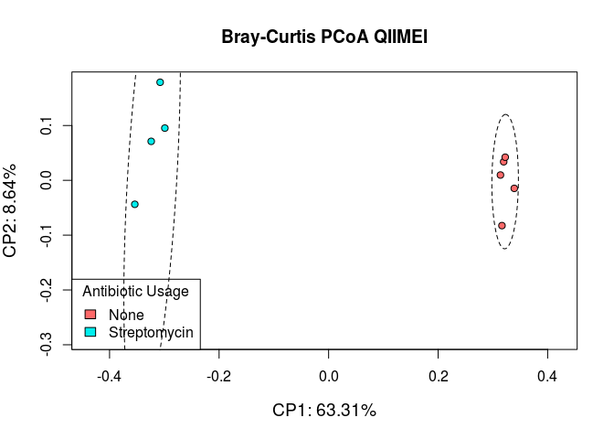<!-- -->

```r
PCOA_plot_legend(mapping_file, OTU_table_DADA2,  bray_dada2, "Bray-Curtis PCoA DADA2")
```

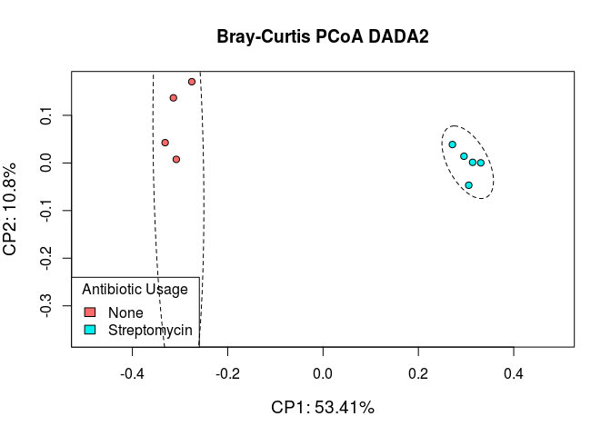<!-- -->


# Session_Info


```r
sessionInfo()
```

```
## R version 3.5.1 (2018-07-02)
## Platform: x86_64-pc-linux-gnu (64-bit)
## Running under: Ubuntu 16.04.5 LTS
## 
## Matrix products: default
## BLAS: /usr/lib/openblas-base/libblas.so.3
## LAPACK: /usr/lib/libopenblasp-r0.2.18.so
## 
## locale:
##  [1] LC_CTYPE=pt_PT.UTF-8       LC_NUMERIC=C              
##  [3] LC_TIME=pt_PT.UTF-8        LC_COLLATE=en_US.UTF-8    
##  [5] LC_MONETARY=pt_PT.UTF-8    LC_MESSAGES=en_US.UTF-8   
##  [7] LC_PAPER=pt_PT.UTF-8       LC_NAME=C                 
##  [9] LC_ADDRESS=C               LC_TELEPHONE=C            
## [11] LC_MEASUREMENT=pt_PT.UTF-8 LC_IDENTIFICATION=C       
## 
## attached base packages:
##  [1] tcltk     grid      stats4    parallel  stats     graphics  grDevices
##  [8] utils     datasets  methods   base     
## 
## other attached packages:
##  [1] tictoc_1.0.1                ranacapa_0.1.0             
##  [3] devtools_1.13.6             forcats_0.3.0              
##  [5] stringr_1.3.1               dplyr_0.7.6                
##  [7] purrr_0.2.5                 readr_1.1.1                
##  [9] tidyr_0.8.1                 tibble_1.4.2               
## [11] tidyverse_1.2.1             BiodiversityR_2.10-1       
## [13] reshape2_1.4.3              Vennerable_3.0             
## [15] xtable_1.8-3                gtools_3.8.1               
## [17] reshape_0.8.7               RColorBrewer_1.1-2         
## [19] RBGL_1.56.0                 graph_1.58.0               
## [21] picante_1.7                 nlme_3.1-137               
## [23] qiimer_0.9.4                dada2_1.8.0                
## [25] Rcpp_0.12.18                vegan_2.5-2                
## [27] lattice_0.20-35             permute_0.9-4              
## [29] ggplot2_3.0.0               msa_1.12.0                 
## [31] codetools_0.2-15            gridExtra_2.3              
## [33] phangorn_2.4.0              ape_5.1                    
## [35] DECIPHER_2.8.1              RSQLite_2.1.1              
## [37] ShortRead_1.38.0            GenomicAlignments_1.16.0   
## [39] SummarizedExperiment_1.10.1 DelayedArray_0.6.6         
## [41] matrixStats_0.54.0          Biobase_2.40.0             
## [43] Rsamtools_1.32.3            GenomicRanges_1.32.6       
## [45] GenomeInfoDb_1.16.0         Biostrings_2.48.0          
## [47] XVector_0.20.0              IRanges_2.14.11            
## [49] S4Vectors_0.18.3            BiocParallel_1.14.2        
## [51] BiocGenerics_0.26.0         phyloseq_1.24.2            
## 
## loaded via a namespace (and not attached):
##   [1] readxl_1.1.0           backports_1.1.2        Hmisc_4.1-1           
##   [4] fastmatch_1.1-1        plyr_1.8.4             igraph_1.2.2          
##   [7] lazyeval_0.2.1         splines_3.5.1          digest_0.6.17         
##  [10] foreach_1.5.1          htmltools_0.3.6        relimp_1.0-5          
##  [13] magrittr_1.5           checkmate_1.8.5        memoise_1.1.0         
##  [16] cluster_2.0.7-1        openxlsx_4.1.0         tcltk2_1.2-11         
##  [19] modelr_0.1.2           RcppParallel_4.4.1     sandwich_2.5-0        
##  [22] colorspace_1.4-0       rvest_0.3.2            blob_1.1.1            
##  [25] haven_1.1.2            crayon_1.3.4           RCurl_1.95-4.11       
##  [28] jsonlite_1.5           lme4_1.1-18-1          bindr_0.1.1           
##  [31] survival_2.42-6        zoo_1.8-3              iterators_1.0.11      
##  [34] glue_1.3.0             gtable_0.2.0           zlibbioc_1.26.0       
##  [37] car_3.0-3              Rhdf5lib_1.2.1         abind_1.4-7           
##  [40] scales_1.0.0           pheatmap_1.0.10        DBI_1.0.0             
##  [43] htmlTable_1.12         foreign_0.8-71         bit_1.1-14            
##  [46] Formula_1.2-3          survey_3.33-2          httr_1.3.1            
##  [49] htmlwidgets_1.2        acepack_1.4.1          pkgconfig_2.0.2       
##  [52] nnet_7.3-12            labeling_0.3           tidyselect_0.2.4      
##  [55] rlang_0.2.2            munsell_0.5.0          cellranger_1.1.0      
##  [58] tools_3.5.1            cli_1.0.0              ade4_1.7-13           
##  [61] broom_0.5.0            evaluate_0.11          biomformat_1.8.0      
##  [64] yaml_2.2.0             knitr_1.20             bit64_0.9-8           
##  [67] zip_1.0.0              bindrcpp_0.2.2         xml2_1.2.0            
##  [70] compiler_3.5.1         rstudioapi_0.7         curl_3.2              
##  [73] e1071_1.7-0            stringi_1.2.4          Matrix_1.2-15         
##  [76] nloptr_1.0.4           multtest_2.36.0        effects_4.0-4         
##  [79] RcmdrMisc_2.5-1        pillar_1.3.0           data.table_1.11.4     
##  [82] bitops_1.0-6           R6_2.2.2               latticeExtra_0.6-28   
##  [85] hwriter_1.3.2          rio_0.5.10             MASS_7.3-50           
##  [88] assertthat_0.2.0       rhdf5_2.24.0           rprojroot_1.3-2       
##  [91] withr_2.1.2            nortest_1.0-4          Rcmdr_2.5-2           
##  [94] GenomeInfoDbData_1.1.0 mgcv_1.8-24            hms_0.4.2             
##  [97] quadprog_1.5-5         rpart_4.1-13           class_7.3-14          
## [100] minqa_1.2.4            rmarkdown_1.10         carData_3.0-1         
## [103] lubridate_1.7.4        base64enc_0.1-4
```


